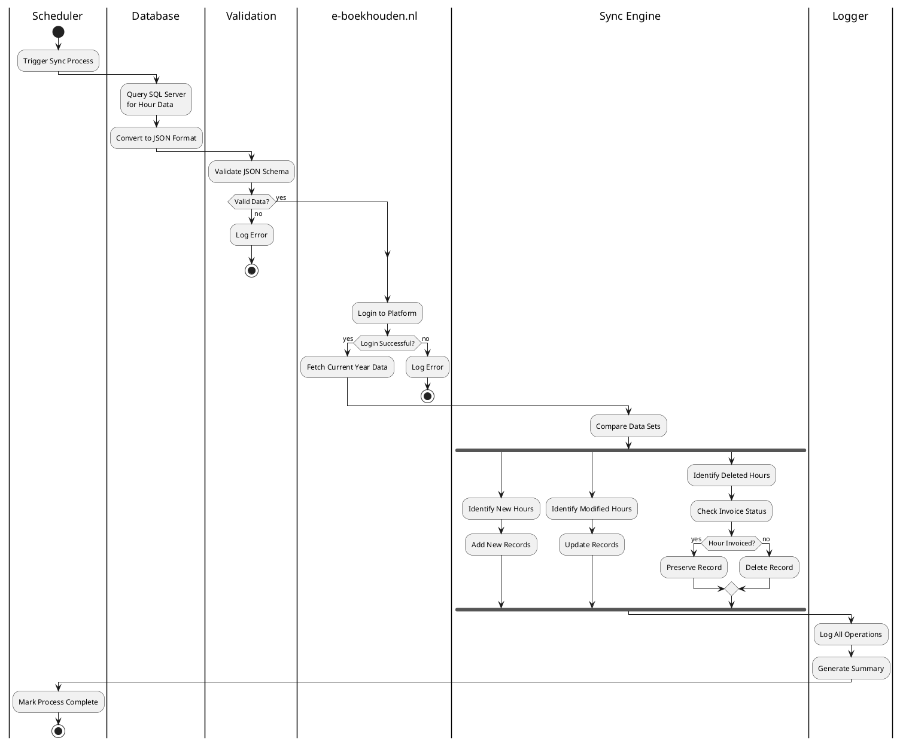

# eBoekhoudRobot

An automated RPA (Robotic Process Automation) solution for synchronizing hour data between a local SQL Server database and e-boekhouden.nl.

## Project Objectives

1. Retrieve hour data from a local SQL Server database in JSON format
2. Log in to the e-boekhouden website
3. Fetch existing hour data for a financial year (default: current year)
4. Compare and synchronize data:
   - Add new hours from database to e-boekhouden
   - Update modified hours in e-boekhouden
   - Delete non-invoiced hours from e-boekhouden if they're not in the database
5. Preserve invoiced hours in e-boekhouden (no modifications/deletions)
6. Comprehensive logging of all actions and errors
7. Support for local execution and scheduling (cron/Windows Task Scheduler)

## Program Flow



## Technical Features

- Robust error handling and logging
- Proper timezone management
- Consistent database operations
- Secure credential handling
- Environment-based configuration
- Comprehensive test coverage
- Well-documented functionality
- Detailed operation logging with timestamps

## Prerequisites

- Python (version specified in `conda.yaml`)
- SQL Server database
- e-boekhouden.nl account with API access
- Required Python packages (listed in `conda.yaml`)

## Installation

1. Clone this repository
2. Install dependencies using Conda:
   ```bash
   conda env create -f conda.yaml
   ```
3. Create a `.env` file with required credentials (see `.env.example` if available)

## Configuration

The project uses environment variables for configuration. Required variables:

- Database connection details
- e-boekhouden.nl credentials
- Other configuration parameters (see documentation)

## Usage

Run the main script:

```bash
python main.py
```

For scheduling, configure your system's task scheduler to run the script at desired intervals.

## Project Structure

- `src/` - Core source code
- `schemas/` - Database and validation schemas
- `docs/` - Documentation
- `temp/` - Temporary files (ignored by git)
- `tests/` - Test suite

## Contributing

1. Fork the repository
2. Create a feature branch
3. Commit your changes
4. Push to the branch
5. Create a Pull Request

## License

[Specify your license here]

## Support

For support and questions, please [create an issue](link-to-issues) in this repository. 