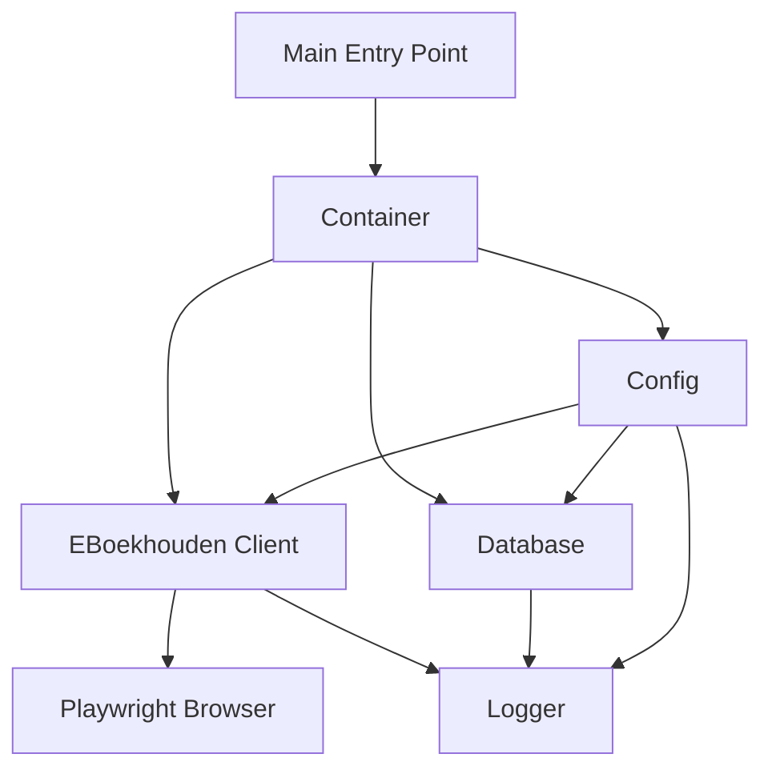
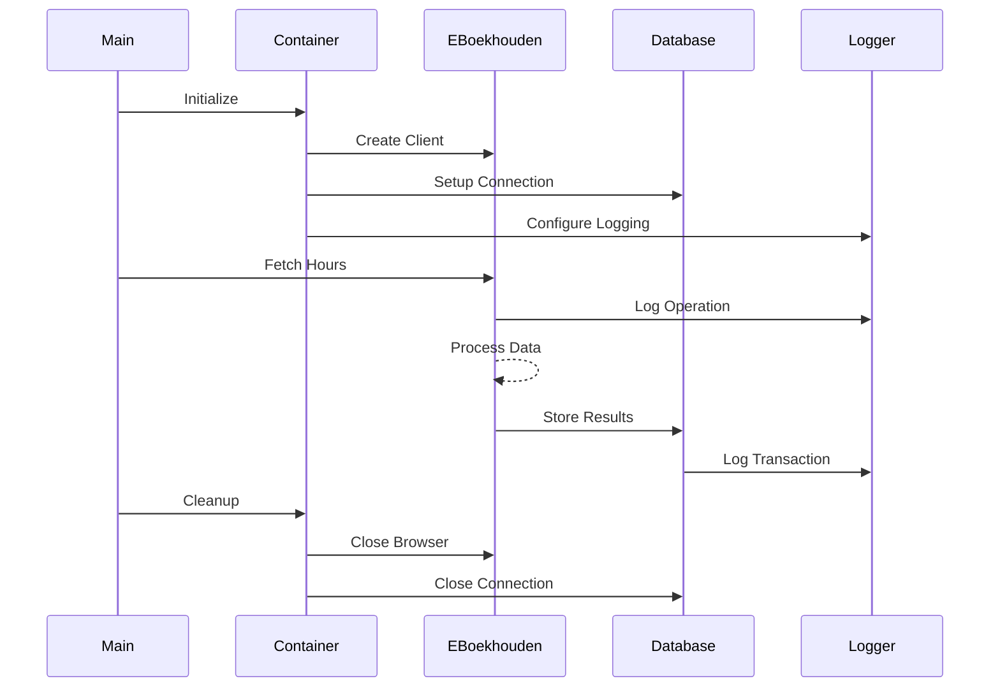

# eBoekhoudRobot Architecture

## Overview

eBoekhoudRobot is a Robotic Process Automation (RPA) solution designed to automate interactions with e-boekhouden.nl. The system follows a modular architecture with clear separation of concerns and robust error handling.

## System Architecture

## Core Components

### 1. Container (Dependency Injection)
- Manages component lifecycle
- Handles resource cleanup
- Provides dependency injection
- Centralizes configuration

### 2. EBoekhouden Client
- Manages browser automation
- Handles web interactions
- Processes data extraction
- Implements error recovery

### 3. Configuration System
- Environment-based config
- Validation via Pydantic
- Secure credential management
- Component-specific settings

### 4. Logging System
- Component-specific loggers
- Rotating file handlers
- Structured logging
- Error tracking

### 5. Database Layer
- Data persistence
- Schema validation
- Transaction management
- Error handling

## Data Flow

## Error Handling Strategy

### 1. Prevention
- Input validation
- Configuration validation
- Pre-condition checks
- Type checking

### 2. Detection
- Exception monitoring
- Timeout handling
- Data validation
- Resource monitoring

### 3. Recovery
- Retry mechanisms
- Graceful degradation
- State preservation
- Cleanup procedures

### 4. Reporting
- Error logging
- Screenshot capture
- State dumps
- Audit trails

## Security Considerations

### 1. Credentials
- Environment variables
- Secure storage
- No hardcoding
- Access control

### 2. Data Protection
- Secure connections
- Data encryption
- Safe storage
- Access logging

### 3. Resource Protection
- Timeouts
- Rate limiting
- Resource cleanup
- Error boundaries

## Performance Optimization

### 1. Browser Automation
- Connection pooling
- Request batching
- Efficient selectors
- State caching

### 2. Data Processing
- Batch operations
- Async processing
- Memory management
- Resource pooling

### 3. Storage
- Efficient queries
- Index optimization
- Connection pooling
- Cache utilization

## Development Guidelines

### 1. Code Organization
- Clear module boundaries
- Dependency injection
- Interface-based design
- SOLID principles

### 2. Testing
- Unit tests
- Integration tests
- Mocking strategy
- Test coverage

### 3. Documentation
- Code comments
- API documentation
- Architecture docs
- Change logs

## Deployment

### 1. Requirements
- Python 3.13+
- Playwright
- Database system
- Environment setup

### 2. Configuration
- Environment variables
- Config validation
- Logging setup
- Resource allocation

### 3. Monitoring
- Log analysis
- Error tracking
- Performance metrics
- Resource usage

## Future Considerations

### 1. Scalability
- Parallel processing
- Load distribution
- Resource optimization
- Caching strategy

### 2. Maintainability
- Code modularization
- Documentation updates
- Test coverage
- Dependency management

### 3. Feature Expansion
- Additional automations
- Integration options
- Reporting capabilities
- User interface 